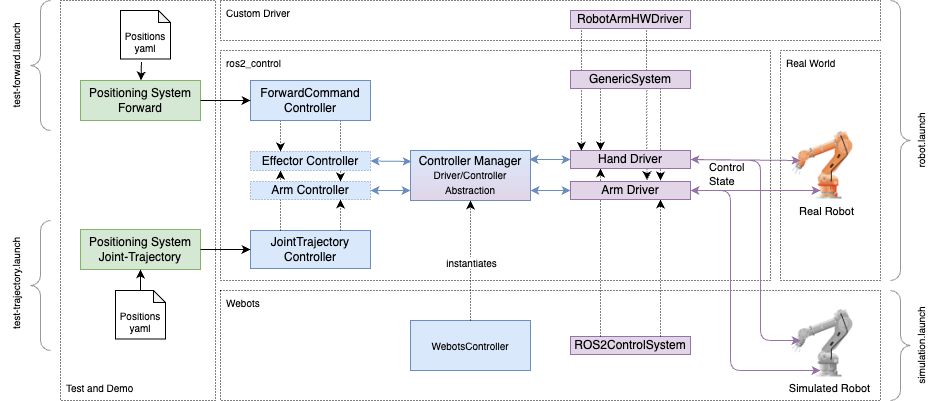

# factory



## About

Installs

- ROS2 Jazzy Jalisco
- ros2_control
- Gazebo Harmonic

## How to launch the docker image

```sh
cd factory/docker/arm-multipass-jazzy
docker compose build
docker compose up -d
docker exec -itd arm-multipass-jazzy-ros terminator

# remove container
docker compose down
docker container rm -f arm-multipass-rolling-ros-1
```

## Build the robot arm example

Follow the instructions here: [src/robot_arm_ctrl/_doc/_readme](src/robot_arm_ctrl/_doc/_readme.md)

